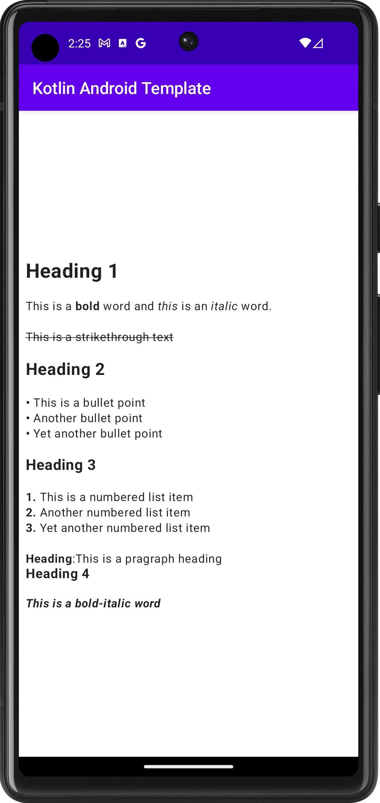
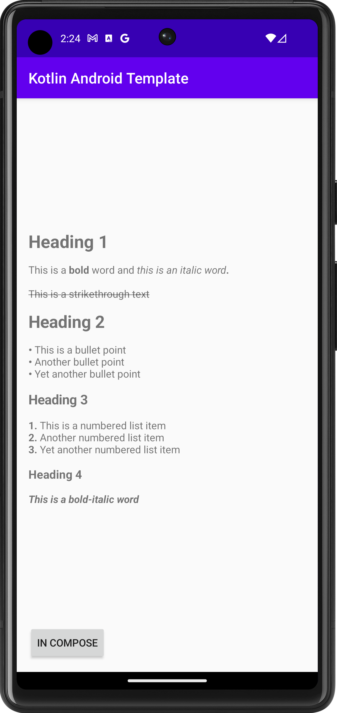

# MDParserKit Core 
## version = 1.0.0

MDParserKit Core is a library that provides the functionality to parse markdown text and convert it
into
an [AnnotatedString](https://developer.android.com/reference/kotlin/androidx/compose/ui/text/AnnotatedString)
with appropriate styles.

## Installation

Add the following dependency to your app-level `build.gradle` file:

```groovy
dependencies {
    implementation 'io.github.dakshsemwal:mdparserkitcore:<version_number>'
}
```

```kotlin
dependencies {
    implementation("io.github.dakshsemwal:mdparserkitcore:<version_number>")
}
```

## How to Use With JetpackCompose Text

To parse a markdown string and get
an [AnnotatedString](https://developer.android.com/reference/kotlin/androidx/compose/ui/text/AnnotatedString)
, use the `parseMarkdown` function:

```kotlin
package com.daksh.mdparserkit.app

import android.os.Bundle
import androidx.activity.ComponentActivity
import androidx.activity.compose.setContent
import androidx.compose.animation.ExperimentalAnimationApi
import androidx.compose.foundation.layout.Box
import androidx.compose.foundation.layout.fillMaxSize
import androidx.compose.foundation.layout.padding
import androidx.compose.foundation.layout.wrapContentSize
import androidx.compose.material.MaterialTheme
import androidx.compose.material.Scaffold
import androidx.compose.material.Text
import androidx.compose.material.TopAppBar
import androidx.compose.runtime.Composable
import androidx.compose.ui.Alignment
import androidx.compose.ui.Modifier
import androidx.compose.ui.tooling.preview.Preview
import androidx.compose.ui.unit.dp
import com.daksh.mdparserkit.app.ui.components.MarkdownTextBox

class ComposeActivity : ComponentActivity() {
    @ExperimentalAnimationApi
    override fun onCreate(savedInstanceState: Bundle?) {
        super.onCreate(savedInstanceState)
        setContent {
            AppMain()
        }
    }
}

@ExperimentalAnimationApi
@Preview
@Composable
fun AppMain() {
    MaterialTheme {
        Scaffold(
            topBar = {
                TopAppBar(
                    title = { Text(text = "Kotlin Android Template") },
                    backgroundColor = MaterialTheme.colors.primary
                )
            },
            backgroundColor = MaterialTheme.colors.background
        ) {
            Box(
                modifier = Modifier
                    .padding(it)
                    .fillMaxSize()
                    .wrapContentSize(align = Alignment.Center)
                    .padding(horizontal = 8.dp)
            ) {
                MarkdownTextBox(
                    "# Heading 1\n" +
                            "\n" +
                            "This is a **bold** word and *this* is an _italic_ word.\n" +
                            "\n" +
                            "~~This is a strikethrough text~~\n" +
                            "\n" +
                            "## Heading 2\n" +
                            "\n" +
                            "- This is a bullet point\n" +
                            "- Another bullet point\n" +
                            "- Yet another bullet point\n" +
                            "\n" +
                            "### Heading 3\n" +
                            "\n" +
                            "1. This is a numbered list item\n" +
                            "2. Another numbered list item\n" +
                            "3. Yet another numbered list item\n" +
                            "\n" +
                            "**Heading**:This is a pragraph heading\n" +
                            "#### Heading 4\n" +
                            "\n" +
                            "**_This is a bold-italic word_**\n"
                )
            }
        }
    }
}

```

```kotlin
import com.daksh.mdparserkit.core.parseMarkdown

@Composable
fun MarkdownTextBox(markdown: String) {
    Text(
        text = parseMarkdown(markdown),
        modifier = Modifier.fillMaxWidth()
    )
}
```



The resulting `AnnotatedString` will have appropriate styles applied to the markdown syntax.

## Functionality

MDParserKit Core provides the following functions:

### `parseMarkdown`

Parses a given markdown text and converts it into an [AnnotatedString] with appropriate styles.

```kotlin
import androidx.compose.ui.text.AnnotatedString
import com.daksh.mdparserkit.core.parseMarkdown

/**
 * @param markdownText The input markdown text to parse.
 * @return An [AnnotatedString] with styles applied according to the markdown syntax.
 */
fun parseMarkdown(markdownText: String): AnnotatedString
```

### `textMarkDown`

Converts markdown-style text formatting to [AnnotatedString] with appropriate [SpanStyle]s.

```kotlin
import androidx.compose.ui.text.AnnotatedString
import androidx.compose.ui.text.SpanStyle
import androidx.compose.ui.unit.TextUnit
import com.daksh.mdparserkit.core.textMarkDown

/**
 * @param inputText The input text to be converted.
 * @param resultBuilder The [AnnotatedString.Builder] to append the converted text to.
 * @param fontSize The desired font size for the text.
 * @param fontWeight The desired font weight for the text.
 * @return The converted text with markdown formatting replaced by appropriate [SpanStyle]s.
 */
private fun textMarkDown(
    inputText: String,
    resultBuilder: AnnotatedString.Builder,
    fontSize: TextUnit,
    fontWeight: FontWeight = FontWeight.Normal
)
```

## How to Use With Android TextView

### With data binging it is simple

```kotlin
import android.os.Bundle
import androidx.appcompat.app.AppCompatActivity
import com.daksh.mdparserkit.core.parseMarkdown

class MainActivity : AppCompatActivity() {
    override fun onCreate(savedInstanceState: Bundle?) {
        super.onCreate(savedInstanceState)
        setContentView(R.layout.activity_main)

        val markdownContent = "# Heading 1\n" +
                "\n" +
                "This is a **bold** word and *this is an italic word*.\n" +
                "\n" +
                "~~This is a strikethrough text~~\n" +
                "\n" +
                "## Heading 2\n" +
                "\n" +
                "- This is a bullet point\n" +
                "- Another bullet point\n" +
                "- Yet another bullet point\n" +
                "\n" +
                "### Heading 3\n" +
                "\n" +
                "1. This is a numbered list item\n" +
                "2. Another numbered list item\n" +
                "3. Yet another numbered list item\n" +
                "\n" +
                "#### Heading 4\n" +
                "\n" +
                "**_This is a bold-italic word_**\n"

        binding.markdownText.text = parseMarkdown(markdownContent)
    }
}

```

or

### Without data binging

```kotlin
import com.daksh.mdparserkit.core.parseMarkdownUsingSpannableString

class MainActivity : AppCompatActivity() {

    override fun onCreate(savedInstanceState: Bundle?) {
        super.onCreate(savedInstanceState)
        setContentView(R.layout.activity_main)

        val markdownText = "# Heading 1\n" +
                "\n" +
                "This is a **bold** word and *this is an italic word*.\n" +
                "\n" +
                "~~This is a strikethrough text~~\n" +
                "\n" +
                "## Heading 2\n" +
                "\n" +
                "- This is a bullet point\n" +
                "- Another bullet point\n" +
                "- Yet another bullet point\n" +
                "\n" +
                "### Heading 3\n" +
                "\n" +
                "1. This is a numbered list item\n" +
                "2. Another numbered list item\n" +
                "3. Yet another numbered list item\n" +
                "\n" +
                "#### Heading 4\n" +
                "\n" +
                "**_This is a bold-italic word_**\n"

        val spannableString = parseMarkdownUsingSpannableString(markdownText)

        val textView = findViewById<TextView>(R.id.markdown_text)
        textView.text = spannableString
    }
}
```



The resulting `SpannableStringBuilder` will have appropriate styles applied to the markdown syntax.

## Functionality

MDParserKit Core provides the following functions:

### `parseMarkdownUsingSpannableString`

Parses the given markdown text and returns a [SpannableStringBuilder] containing formatted text.

```kotlin
import androidx.compose.ui.text.SpannableStringBuilder

/**
 * @param markdownText the markdown text to parse.
 * @return the formatted text as a SpannableStringBuilder.
 */
fun parseMarkdownUsingSpannableString(markdownText: String): SpannableStringBuilder
```

### `textMarkDown`

Converts markdown-style text formatting to [SpannableStringBuilder] with appropriate [CustomTagSpan]s
and [RelativeSizeSpan]s.

```kotlin
import android.graphics.Typeface
import android.text.SpannableStringBuilder
import android.text.Spanned.SPAN_EXCLUSIVE_EXCLUSIVE
import android.text.style.RelativeSizeSpan
import android.text.style.StyleSpan
import com.daksh.mdparserkit.core.CustomTagSpan

/**
 * @param inputText The input string of text to parse.
 * @param resultBuilder A mutable SpannableStringBuilder to build the styled text.
 * @param textRatio The relative size of the text.
 * @param bold A boolean indicating whether the entire text should be bolded.
 */
fun textMarkDown(
    inputText: String,
    resultBuilder: SpannableStringBuilder,
    textRatio: Float = 1f,
    bold: Boolean = false
)
```

### CustomTagSpan

A custom span that can be used with [TextView] to apply bold, italic, and strike-through formatting
to text.

```kotlin
/**
 * @property isBold A Boolean indicating whether the span should apply bold formatting to the text.
 * @property isItalic A Boolean indicating whether the span should apply italic formatting to the text.
 * @property isStrikeThrough A Boolean indicating whether the span should apply strike-through formatting to the text.
 */
class CustomTagSpan(
    private val isBold: Boolean = false,
    private val isItalic: Boolean = false,
    private val isStrikeThrough: Boolean = false
)
```